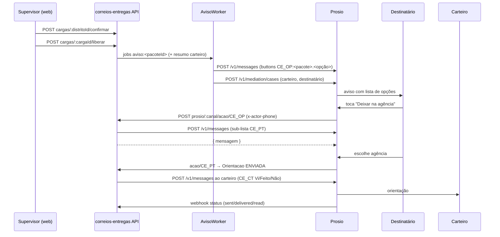

# TechSpec: Entregas Mediadas via WhatsApp (Cadastro, Carregar Dados e Atendimento)

**Status**: Rascunho para revisão do dono do produto
**Data**: 2026-09-30
**Entrada**: [`_prd.md`](_prd.md) · [`_user_stories.md`](_user_stories.md) (US-001–US-040) · [`adrs/`](adrs/) (001–017)
**Contrato de testes**: [`_tests.md`](_tests.md)
**Protótipo**: https://claude.ai/artifact/T3HneV28vRrr9cKPbTKbFV

## Executive Summary

A feature é um novo domínio `entregas` dentro do monorepo do correios-entregas.

**No backend:**
- Um módulo `backend/src/modules/entregas/` (cadastro, carga do dia, liberação, orientações, entrada do Prosio e atendimento).
- Dois clientes em `integrations/`: Prosio e Seu Rastreio.
- Dois workers BullMQ no processo da API: avisos e rastreio.

**No frontend:**
- Um shell `features/entregas/` sob `/entregas/*`. As telas atuais ficam atrás de "SGPD v2".

O schema passa a ter migrations versionadas a partir de uma linha de base (ADR-013).

**Integração com o Prosio: híbrida (ADR-011).**
- O fluxo estruturado usa o que já está em produção:
  - `POST /api/v1/messages` com `buttons`, que vira lista no WAHA;
  - ações de botão (`buttonAction`), que chamam o correios-entregas;
  - callback de status assinado.
- O texto livre usa a mediação entre partes: "vizinho", "outra opção", o carteiro acionando o destinatário e a moderação.
- Um caso por pacote é aberto na liberação, e o desfecho chega por `mediation.outcome`.
- A ligação da mediação no Prosio está sendo terminada em outra sessão. Este documento fixa o contrato de que precisamos (R1–R7) e só inclui tarefas no Prosio para o roteamento de inbox em tenant compartilhado (P1–P3, ADR-012).

**Trocas principais:**
- Polling de 30 s em vez de SSE (ADR-015).
- Rastreio adaptativo em vez de acompanhamento contínuo (ADR-016).
- A orientação final sempre sai pelo correios-entregas (mensagem com botões ao carteiro), mesmo quando nasce de um caso mediado. O ciclo Vi/Feito fica uniforme, ao custo de o carteiro poder ver o relay do bot e a orientação formal.

## System Architecture

### Component Overview

| Componente | Local | Responsabilidade |
|---|---|---|
| **Cadastro** | `modules/entregas/cadastro.*` | Distritos, carteiros, carteiro do dia (`EscalaDistrito`), pontos de retirada. Unidades e supervisores estendem `modules/gestao` (canal Prosio, `mediacaoAtiva`). |
| **Carga** | `modules/entregas/carga.*`, `planilha.parser.ts` | Prévia sem estado (planilha ou texto), confirmação, quadro do dia, lista de pacotes do distrito, derivação de status. |
| **Liberação** | `modules/entregas/liberacao.service.ts` | Libera o distrito: enfileira avisos (com adiamento noturno), resumo ao carteiro e abertura dos casos de mediação. Idempotente. |
| **Orientação** | `modules/entregas/orientacao.service.ts` | Máquina de estados da orientação: criar, substituir, guardar para o próximo dia, enviar ao carteiro, registrar Vi/Feito/Não foi possível, orientação manual. |
| **Entrada Prosio** | `modules/entregas/prosio-entrada.*` | Webhook assinado (status de mensagem e `mediation.outcome`) e ações de botão (`CE_OP`, `CE_PT`, `CE_SN`, `CE_CT`). |
| **Atendimento** | `modules/entregas/atendimento.*` | Sessão de login único do Chatwoot via Prosio `/api/v1/atendimento/sessoes`; devolve a URL do iframe. |
| **ProsioClient** | `integrations/prosio/` | `enviarMensagem`, `abrirCaso`, `cancelarCaso`, `criarSessaoAtendimento`, verificação de HMAC. Credenciais por `CanalProsio`, decifradas sob demanda. |
| **RastreioClient** | `integrations/seu-rastreio/` | `consultar(codigo)` com limite de 3 s; `classificarEvento(descricao)` → `ENTREGUE`, `INSUCESSO` ou `null`. |
| **AvisoWorker** | `workers/entregas-aviso.worker.ts` | Fila `entregas-aviso`: envia o aviso de cada pacote e o resumo ao carteiro; abre o caso de mediação. |
| **RastreioWorker** | `workers/entregas-rastreio.worker.ts` | Fila `entregas-rastreio`: repetição a cada hora (7h–20h) mais a varredura das 20h; atualiza os status. |
| **Utilitários** | `shared/utils/s10.ts` (corrigido), `shared/utils/telefone.ts`, `shared/utils/cripto.ts` | Validação S10 com qualquer país; E.164 BR; AES-256-GCM para os segredos dos canais. |
| **Frontend Entregas** | `frontend/src/features/entregas/` | `EntregasShell`, CarregarDadosPage, CargaDistritoPage, DistritoPacotesPage, CadastroPage, AtendimentoPage, RotasEmBrevePage; stores Zustand com polling. |

**Fluxo principal:**



- **"Vizinho" e "outra opção":** o toque em `CE_OP` atualiza os fatos do caso (R2) e responde com a pergunta. A mensagem livre seguinte cai no caso mediado (única conversa aberta daquele telefone). O bot interpreta, confirma e registra o desfecho (R4), que chega por `webhook` como `mediation.outcome` e vira `Orientacao`.
- **Carteiro acionando o destinatário:** o carteiro escreve ao número da unidade, e o Prosio resolve o caso (R5) e faz o relay. O desfecho segue o mesmo caminho.

## Implementation Design

### Core Interfaces

```ts
// backend/src/integrations/prosio/prosio.client.ts
export interface ProsioClient {
  enviarMensagem(canal: CanalResolvido, msg: {
    to: string; body: string; reference: string; idempotencyKey: string;
    buttons?: { id: string; text: string }[]; unidadeRef?: string;
  }): Promise<{ messageId: string }>;
  abrirCaso(canal: CanalResolvido, caso: {
    externalRef: string; providerPhone: string; recipientPhone: string;
    motivo?: MotivoMediacao; resumo: string; respondBy: Date; unidadeRef?: string;
  }): Promise<{ caseId: string; created: boolean }>;
  atualizarFatosCaso(canal: CanalResolvido, caseId: string, fatos: { motivoRelatado: MotivoMediacao; perguntaAberta: string }): Promise<void>;
  cancelarCaso(canal: CanalResolvido, caseId: string): Promise<void>;
  criarSessaoAtendimento(canal: CanalResolvido, u: { idExterno: string; nome: string; email: string; papel: 'agente' | 'administrador'; unidadeRef?: string }): Promise<{ url: string; expiraEm: string }>;
}
export class ProsioError extends Error { constructor(public status: number, public code: string) { super(code); } }
```

```ts
// backend/src/modules/entregas/orientacao.service.ts
export type TipoOrientacao = 'AMANHA' | 'VIZINHO' | 'AGENCIA' | 'LOCKER' | 'OUTRA' | 'MANUAL';
export interface NovaOrientacao {
  pacoteId: string; tipo: TipoOrientacao; texto: string;           // texto ≤ 300
  pontoRetiradaId?: string; vizinhoNome?: string; vizinhoCasa?: string;
  origem: 'BOTAO' | 'MEDIACAO' | 'SUPERVISOR'; criadaPorId?: string;
  valeParaAmanha?: boolean;                                         // guarda em vez de enviar hoje
}
export interface OrientacaoService {
  registrar(o: NovaOrientacao): Promise<Orientacao>;               // substitui a vigente; decide enviar ou guardar
  registrarRespostaCarteiro(orientacaoId: string, telefone: string,
    resposta: 'VI' | 'FEITO' | 'NAO_ATENDEU' | 'ENDERECO' | 'RECUSOU' | 'FECHADO' | 'OUTRO'): Promise<string>;
  reaplicarGuardadas(cargaId: string): Promise<number>;             // na confirmação da carga
}
```

**Convenções de erro:**
- Serviços lançam `AppError(status, mensagem, details?)` (padrão existente).
- **Concorrência de edição de cadastro:** os `PUT` enviam `atualizadoEm`; divergência → 409 `alterado_por_outro` com os dados atuais (US-001.EC-4).
- **Usuário desativado:** o `authenticate` passa a recusar token de usuário com `ativo=false` (consulta com cache de 60 s) (US-002.EC-3).
- **"Próximo dia de entrega":** segunda a sexta; sexta → segunda. Os dias da unidade são configuráveis numa versão futura.
- **Limite de tentativas:** um código com 2 dias anteriores em `INSUCESSO` não aceita "amanhã" e é escalonado (US-013.EC-4).
- **Fim do caso:** pacote `ENTREGUE` cancela o caso de mediação aberto (`cancelarCaso`).
- Falhas do Prosio viram `ProsioError(status, code)`. Nas rotas do supervisor elas se tornam 502 ou 503 com mensagem legível. Nos workers acionam o retry do BullMQ (5 tentativas, backoff exponencial).
- Nas ações de botão, nunca se devolve erro HTTP por regra de negócio. A resposta é sempre `200 { mensagem }` com texto para o usuário. Só a autenticação inválida responde 401.

### Data Models

Prisma (`backend/prisma/schema.prisma`), mudanças desta feature:

```prisma
enum TipoCanal { WAHA WABA }
enum StatusCarga { CARREGADO LIBERADO EM_ENTREGA CONCLUIDO }
enum StatusPacote { SEM_WHATSAPP AGUARDANDO_LIBERACAO AGENDADO NAO_ENVIADO ENVIADO LIDO INTERAGINDO INSUCESSO ENTREGUE }
enum TipoPonto { AGENCIA LOCKER }
enum TipoOrientacao { AMANHA VIZINHO AGENCIA LOCKER OUTRA MANUAL }
enum EstadoOrientacao { AGUARDANDO_CONFIRMACAO ENVIADA VISTA FEITA NAO_FOI_POSSIVEL GUARDADA SUBSTITUIDA }
enum OrigemOrientacao { BOTAO MEDIACAO SUPERVISOR }

model CanalProsio {
  id String @id @default(uuid())
  nome String
  baseUrl String                         // origin, ex. https://prosio.com.br
  apiKeyCifrada String                   // AES-256-GCM (ENTREGAS_CRYPTO_KEY)
  callbackSecretCifrado String
  tokenEntradaHash String                // sha256 do bearer usado pelas integrações do Prosio
  tipo TipoCanal @default(WAHA)
  compartilhado Boolean @default(false)
  ativo Boolean @default(true)
  unidades Unidade[]
}

model Distrito {
  id String @id @default(uuid())
  unidadeId String
  codigo String
  nome String
  carteiroPadraoId String?
  ativo Boolean @default(true)
  @@unique([unidadeId, codigo])
}

model EscalaDistrito {                   // carteiro do dia (troca só hoje)
  distritoId String
  data DateTime @db.Date
  carteiroId String
  @@id([distritoId, data])
}

model CargaDistrito {
  id String @id @default(uuid())
  distritoId String
  data DateTime @db.Date
  status StatusCarga @default(CARREGADO)
  carteiroId String?                     // snapshot na liberação
  liberadoEm DateTime?
  liberadoPorId String?
  @@unique([distritoId, data])
}

model PacoteDia {
  id String @id @default(uuid())
  cargaId String
  data DateTime @db.Date                 // desnormalizado para a unicidade
  codigo String @db.Char(13)
  nome String
  whatsappE164 String?
  logradouro String?  numero String?  complemento String?  bairro String?
  cidade String?  uf String? @db.Char(2)  cep String? @db.Char(8)  enderecoTexto String?
  referencia String?
  status StatusPacote
  naoEnviadoMotivo String?
  escalonado Boolean @default(false)
  prosioMessageId String?
  mediacaoCaseId String?
  rastreioDescricao String?  rastreioEm DateTime?
  @@unique([codigo, data])
  @@index([cargaId, status])
}

model PontoRetirada {
  id String @id @default(uuid())
  unidadeId String
  tipo TipoPonto
  nome String @db.VarChar(24)
  endereco String
  horario String
  ativo Boolean @default(true)
}

model Orientacao {
  id String @id @default(uuid())
  codigo String @db.Char(13)             // liga dias diferentes do mesmo pacote
  pacoteId String?                       // null enquanto guardada sem carga
  tipo TipoOrientacao
  texto String @db.VarChar(300)
  pontoRetiradaId String?  vizinhoNome String?  vizinhoCasa String?
  estado EstadoOrientacao
  origem OrigemOrientacao
  criadaPorId String?
  carteiroId String?
  respostaCarteiro String?  respondidoEm DateTime?
  valeAPartirDe DateTime? @db.Date
  criadaEm DateTime @default(now())
  @@index([codigo, estado])
}

model EventoPacote { id String @id @default(uuid()) pacoteId String tipo String dados Json criadoEm DateTime @default(now()) @@index([pacoteId, criadoEm]) }
model DescadastroWhatsapp { whatsappE164 String @id em DateTime @default(now()) }
model WebhookRecebido { chave String @id recebidoEm DateTime @default(now()) }
```

**Alterações em modelos existentes:**
- `Unidade`: `canalProsioId String?`, `prosioUnidadeRef String?` (obrigatório quando o canal é compartilhado), `mediacaoAtiva Boolean @default(false)`.
- `Carteiro`: `usuarioId String? @unique`, `nome String?`, `whatsappE164 String? @unique`, `ativo Boolean @default(true)`.

**Invariantes aplicadas no serviço** (não expressáveis no schema):
- no máximo 10 `PontoRetirada` ativos por `(unidadeId, tipo)`;
- no máximo uma `Orientacao` vigente (não `SUBSTITUIDA`) por `codigo`;
- a matrícula é única entre `Usuario.matricula` e `Carteiro.matricula`.

**Derivação do status:**

| Dado | Regra |
|---|---|
| Quadro — pendente de upload | Não existe `CargaDistrito` do dia (ou ela tem 0 pacotes). |
| Quadro — dados carregados | `CARREGADO`. |
| Quadro — liberado | Liberado sem nenhum aviso `ENVIADO` ainda. |
| Quadro — em entrega | Liberado com algum aviso `ENVIADO` ou além. |
| Quadro — concluído | Todos os pacotes `ENTREGUE`, `INSUCESSO`, `SEM_WHATSAPP` com status final do rastreio, ou `NAO_ENVIADO` após as 20h. |
| Pacote | Avança só para frente: `ENVIADO` < `LIDO` < `INTERAGINDO` < estados finais (`INSUCESSO`, `ENTREGUE`). O callback `read` depois de `INTERAGINDO` não regride. |

### API Endpoints

Todos sob `/api/v1/entregas`. O JWT é obrigatório, exceto em `prosio/*`.

**Escopo:**
- `UNIDADE` enxerga só `req.user.unidadeId`. Outra unidade → **404** (não se confirma a existência).
- `GESTAO` enxerga todas as unidades, via `?unidadeId=`.

**Cadastro:**

| Método e rota | Papel | Corpo / resposta |
|---|---|---|
| `GET/POST /cadastro/distritos`, `PUT /cadastro/distritos/:id` | UNIDADE | `{codigo, nome, carteiroPadraoId?, ativo}`. Código repetido → 409. Desativar distrito liberado hoje → 409. |
| `PUT /cadastro/distritos/:id/escala/:data` | UNIDADE | `{carteiroId}`. Troca o carteiro só na data. Se o distrito já está liberado, reenvia o resumo ao novo carteiro. |
| `GET/POST /cadastro/carteiros`, `PUT /cadastro/carteiros/:id` | UNIDADE | `{nome, matricula, whatsapp, distritoPadraoId?}`. WhatsApp inválido → 400; matrícula ou WhatsApp repetido → 409. |
| `GET/POST /cadastro/pontos`, `PUT /cadastro/pontos/:id` | UNIDADE | `{tipo, nome≤24, endereco, horario, ativo}`. 11º ativo do tipo → 409 `limite_pontos`. |
| `GET/POST/PUT /api/v1/gestao/unidades` (existente, estendido) | GESTAO | Mais `{canalProsioId, prosioUnidadeRef, mediacaoAtiva}`. |
| `GET/POST/PUT /api/v1/gestao/canais-prosio` | GESTAO | `{nome, baseUrl, apiKey, callbackSecret, tipo, compartilhado}`. Na criação, devolve **uma vez** o token de entrada gerado. Segredos nunca voltam em GET. |
| `/api/v1/gestao/usuarios` (existente) | GESTAO | Supervisor = `role UNIDADE` com `unidadeId`, `matricula` e `telefoneCelular`. |

**Carga (Monitoramento › Carregar Dados):**

| Método e rota | Papel | Corpo / resposta |
|---|---|---|
| `GET /quadro?data=YYYY-MM-DD` | UNIDADE/GESTAO | `{distritos: [{distritoId, codigo, nome, carteiro, status, total, comWhatsapp, porStatus: {…}, escalonamentos}]}` |
| `POST /cargas/:distritoId/previa` | UNIDADE | Multipart `arquivo` (CSV/XLSX, ≤2 MB) **ou** `{texto}` → `{linhas: [{n, codigo, nome, whatsapp, endereco…, situacao, motivo?, orientacaoGuardada?}], resumo}`. Arquivo de outro tipo → 415; mais de 500 linhas → 413; coluna obrigatória ausente → 400 `coluna_ausente`. |
| `POST /cargas/:distritoId/confirmar` | UNIDADE | `{data, linhas}` → `{aceitos, descartados, cargaId}`. Revalida tudo. Código já em outro distrito no dia → a linha é descartada com motivo. Se a carga já foi liberada, as linhas novas com WhatsApp são avisadas na hora. |
| `POST /cargas/:cargaId/liberar` | UNIDADE | → `202 {avisosAgendados, semWhatsapp, agendadoPara?}`. Sem carteiro → 409 `sem_carteiro`; sem pacotes → 409 `carga_vazia`. Repetir a chamada não gera avisos novos. |
| `GET /cargas/:cargaId/pacotes?status=&busca=&pagina=` | UNIDADE/GESTAO | Lista paginada com status, sinalizações, orientação vigente e resposta do carteiro. |
| `PATCH /pacotes/:id` | UNIDADE | `{whatsapp?, endereco?}`. Adicionar WhatsApp a pacote de carga liberada → envia o aviso. |
| `POST /pacotes/:id/orientacao` | UNIDADE | `{texto≤300, valeParaAmanha}`. Orientação manual (US-026). Pacote `ENTREGUE` → 409. |

**Atendimento:**

| Método e rota | Papel | Resposta |
|---|---|---|
| `POST /atendimento/sessao` | UNIDADE/GESTAO | `{unidadeId?}` → `{url, expiraEm}`. A URL é de uso único, vale 4 min 50 s e vai direto no `src` do iframe. Chatwoot indisponível → 503 `atendimento_indisponivel`. Outros papéis → 403. |

**Entrada do Prosio (sem JWT, ADR-014):**

| Método e rota | Autenticação | Contrato |
|---|---|---|
| `POST /prosio/:canalId/webhook` | `X-Webhook-Signature` (HMAC do corpo cru, segredo do canal) | Status de mensagem ou `mediation.outcome` → `204`. Assinatura inválida → 401; evento repetido → 204 sem efeito. |
| `POST /prosio/:canalId/acao/:prefixo` | `Bearer <token de entrada>` | Corpo `{acao: "<id>.<valor>"}` e header `x-actor-phone` → `200 {mensagem}`. Prefixos: `CE_OP` (`<pacoteId>.AMANHA\|VIZINHO\|AGENCIA\|LOCKER\|OUTRA`), `CE_PT` (`<pacoteId>.<pontoId>`), `CE_SN` (`<orientacaoId>.SIM\|NAO`), `CE_CT` (`<orientacaoId>.VI\|FEITO\|NAO\|NAO_ATENDEU\|ENDERECO\|RECUSOU\|FECHADO\|OUTRO`). |

## Integration Points

### Prosio — API de mensagens (em produção)

- **Autenticação:** `Authorization: Bearer <apiKey do canal>` em `POST {baseUrl}/api/v1/messages`.
- **Idempotência e referência:** `Idempotency-Key` = `aviso:<pacoteId>`, `resumo:<cargaId>:<carteiroId>` ou `orient:<orientacaoId>`. `reference` = `<pacoteId>` ou `o:<orientacaoId>`.
- **Botões:** até 10, com texto ≤ 60 e id ≤ 200.
- **Limites de envio:**
  - Taxa: 30/min por chave. O AvisoWorker usa `limiter` do BullMQ (25 jobs/min por canal) e respeita 429 com retry.
  - Anti-ban (00h–06h, aquecimento, proporção de respostas): a recusa volta no callback como `failed` + `failureReason` → `NAO_ENVIADO` com o motivo. Recusas por limite diário são reenfileiradas no mesmo dia, com atraso de 30 min, até as 20h.
  - Adiamento noturno: liberação entre 00h e 06h → atraso até 06h05 (regra do PRD).
- **Callback de status:** `sent` → `ENVIADO`, `delivered` → mantém, `read` → `LIDO`, `failed` → `NAO_ENVIADO`. `recipientOptOut.optedOut` → `DescadastroWhatsapp`.

### Prosio — ações de botão (em produção)

Provisionamento por tenant (roteiro, não código): quatro `Integration` com `buttonAction` `CE_OP`, `CE_PT`, `CE_SN` e `CE_CT`. Cada uma:
- faz `POST {APP_URL}/api/v1/entregas/prosio/<canalId>/acao/<prefixo>`;
- tem uma única entrada `acao`;
- tem `mappings.context` com o telefone (`x-actor-phone`);
- usa uma `ApiConnection` com o token de entrada.

A deduplicação do Prosio (telefone + botão) torna o toque repetido idempotente. O serviço também é idempotente por conta própria.

### Prosio — mediação entre partes (dependência externa, sendo ligada em outra sessão)

**Uso previsto:** `POST /api/v1/mediation/cases` na liberação, para cada pacote com WhatsApp e mediação ativa na unidade:
- `externalRef` = `<codigo>@<data>`;
- `providerPhone` = carteiro do dia;
- `recipientPhone` = destinatário;
- `motivo` omitido.

Opt-in: declaração do tenant no painel do Prosio (US-034). O desfecho `mediation.outcome` chega ao webhook do canal e vira `Orientacao` com `origem MEDIACAO`:

| Desfecho | Orientação |
|---|---|
| `motivo: entrega_indireta` com `condicao.local` | `VIZINHO` |
| `outro` / `reagendamento` | `OUTRA` |
| `destinatario_ausente` com `condicao.ate` de outro dia | `AMANHA` |
| `disposition: proposto` | Não esperado (envelope todo automático): registrado e sinalizado ao supervisor. |

As propostas de conhecimento (`conhecimento`) são gravadas em `EventoPacote` e não persistidas como conhecimento durável.

**Requisitos de contrato para a sessão que liga a mediação** (a confirmar antes da implementação). Sem o R7, o sinal de escalonamento só aparece para os escalonamentos feitos pelo próprio correios-entregas (limite de tentativas, divergência, mediação desligada):

| # | Requisito | Por quê |
|---|---|---|
| **R1** | Abrir caso **sem** o primeiro contato da mediação (ex.: `firstContact: 'integrador'`), porque o aviso com opções é nosso. | Evita duas mensagens iniciais e a mensagem fixa sem opções. |
| **R2** | Atualizar os fatos do caso depois de aberto (`motivoRelatado`, `perguntaAberta`), ou aceitá-los na abertura. | O toque em "vizinho" ou "outra" define o que o bot pergunta. |
| **R3** | Prazo do caso por caso (`respondBy`/expiração até o fim do dia de entrega), em vez dos 120 min fixos. | O caso vive o dia todo. |
| **R4** | O bot registra o desfecho (`recordMediationOutcome`) após a confirmação da ponta, com `motivo` e `condicao`, e o callback sai. | É o que dispara a orientação ao carteiro. |
| **R5** | Rótulo de desambiguação por caso (ex.: `resumo: "Maria · QNA 12 Casa 45"`), mostrado quando o prestador tem vários casos abertos. | O carteiro tem 30 a 40 casos e não sabe os códigos. |
| **R6** | Moderação (`guardInboundText`) ativa nos dois lados, e o relay não inclui telefone. | Não divulgação (US-032). |
| **R7** | Callback de escalonamento (ex.: `event: 'mediation.escalated'` com `caseId`, `externalRef` e motivo) quando o bot transfere uma ponta para humano. Opcionalmente, também quando o humano devolve ao bot. | É a única fonte do sinal "escalonamento aberto" do quadro (US-018, US-038). |

### Prosio — roteamento por unidade em tenant compartilhado (tarefas P1–P3 no repositório do Prosio)

- **P1:** `unidadeRef?: string` (≤ 64) em `MessagingSendRequestSchema` e `MediationOpenCaseRequestSchema`, gravado na `Conversation` criada ou reutilizada.
- **P2:** `Tenant.chatwootInboxesPorUnidade Json` (`{[unidadeRef]: inboxId}`). O `chatwoot-mirror-consumer` escolhe a inbox pela `unidadeRef` da conversa, ou usa a inbox padrão.
- **P3:** `POST /api/v1/atendimento/sessoes` aceita `unidadeRef?`. Com ela, adiciona o agente só àquela inbox; sem ela, `papel: administrador` entra em todas.

### Chatwoot (via Prosio)

- A URL da sessão entra no `src` de um `<iframe>` no AtendimentoPage.
- O domínio do correios-entregas precisa estar em `ATENDIMENTO_EMBED_DOMAINS` do Prosio.
- Em Safari com bloqueio de cookies de terceiros, a tela mostra "Abrir em nova aba" com a mesma sessão (nova URL).
- O SSO antigo (`/comunicacao/chatwoot/sso` → delivyodev, conta 7) deixa de ser usado pela área nova e fica para o legado.

### Seu Rastreio

- **Chamada:** `GET https://seurastreio.com.br/api/public/rastreio/{codigo}` com `Authorization: Bearer ${SEU_RASTREIO_TOKEN}`, limite de 3 s, sem retry no caminho síncrono e 3 tentativas no worker.
- **Classificação** (`classificarEvento`): padrões para entregue ("entregue ao destinatário") e para insucesso ("carteiro não atendido", "destinatário ausente", "não efetuada", "endereço insuficiente", "recusado"). A lista é versionada em código.

## Impact Analysis

| Componente | Tipo de impacto | Descrição e risco | Ação necessária |
|---|---|---|---|
| `backend/prisma/schema.prisma` + `migrations/` | modificado | Linha de base e modelos novos; risco médio (bancos existentes). | `0000_baseline` + `resolve --applied` nos bancos de dev/prod; migration da feature. |
| `shared/utils/s10.ts` | modificado | Regra do dígito corrigida; afeta o legado (que estava errado); risco baixo. | Testes com códigos reais; opção `qualquerPais`. |
| `app.ts` | modificado | Monta `/api/v1/entregas` e o roteador `prosio` (corpo cru) **antes** do `express.json` global. | Ordem dos middlewares coberta por teste. |
| `modules/gestao` | modificado | Unidade ganha canal/ref/mediação; CRUD de `CanalProsio`. | Estender schemas e serviço. |
| `Carteiro` | modificado | `usuarioId` opcional; telas do SGPD v2 que fazem join com usuário. | Filtrar `usuarioId != null` nas consultas legadas afetadas. |
| `queue.ts`, `workers/index.ts` | modificado | Duas filas novas e um job repetido. | Registrar em `startWorkers`/`stopWorkers`. |
| `frontend/src/main.tsx`, `LoginPage` | modificado | Rotas `/entregas/*`; redirecionamento por papel. | Legado intacto. |
| `services/api.ts` | modificado | Suporte a `FormData`. | Sem mudança para chamadas JSON. |
| `docker-compose.yml`, `backend/.env.example` | modificado | `ENTREGAS_CRYPTO_KEY`, `SEU_RASTREIO_TOKEN`, `APP_URL` público. | Secrets fora do git. |
| `.github/workflows/ci.yml`, `app.health.test.ts` | modificado | `migrate deploy` passa a criar tabelas; teste de health via supertest. | O CI volta a ser significativo. |
| Prosio (outro repositório) | novo (P1–P3) | Roteamento por inbox em tenant compartilhado. | Tarefas separadas, PR no Prosio. |
| Prosio mediação | dependência | R1–R7 pela outra sessão. | Confirmar R1–R7 antes das tarefas de mediação. |
| SSO antigo `/comunicacao/chatwoot/sso` | inalterado | Continua servindo o legado. | Nenhuma. |

## Testing Approach

- **Backend:** Jest + ts-jest (existente) com **supertest** (já instalado) sobre `app` exportado.
  - **Bordas falsificadas:** Prosio e Seu Rastreio via um servidor HTTP falso em processo (`test/fakes/prosio.fake.ts`, `seu-rastreio.fake.ts`), que grava as requisições e assina callbacks. Relógio via `jest.useFakeTimers` ou `now()` injetado.
  - **Banco:** integração e ponta a ponta usam um banco **dedicado** `correiosentregas_test`, criado pelo `globalSetup` (`prisma migrate reset --force --skip-seed` com `DATABASE_URL` de teste). Nunca o banco de dev (armadilha conhecida: `deleteMany` já apagou tabelas reais em outro projeto). O `globalSetup` recusa rodar se o nome do banco não terminar em `_test`.
  - **Filas:** BullMQ com Redis de teste (serviço do CI), com drenagem explícita da fila nos testes.
- **Frontend:** Playwright para os fluxos de interface (quadro, carga, liberação, cadastro e atendimento com iframe falso), contra o backend em modo de teste com as falsificações. Sem testes unitários de componente; a lógica fica no backend.
- **Níveis:**
  - Unitário: parser, validações (S10, telefone), derivação de status, máquina de orientação, mapeamento de desfecho, classificação do rastreio, cifra.
  - Integração: rotas com banco real, webhook assinado, ações de botão, workers.
  - Ponta a ponta: jornadas completas via API (supertest) e via UI (Playwright).
- **CI:** o job `verify` existente ganha `prisma migrate deploy` no banco de teste e um job opcional `e2e-ui` com Playwright (Chromium).

## Development Sequencing

### Build Order

1. **Base do schema:** `0000_baseline` + ajuste do CI e do teste de health (sem dependências).
2. **Utilitários:** S10 corrigido, `telefone.ts`, `cripto.ts` (sem dependências).
3. **Migration da feature:** modelos e enums novos, alterações em `Unidade` e `Carteiro` (depende do 1).
4. **Clientes:** `ProsioClient` e `RastreioClient` com falsificações de teste (depende do 2).
5. **Cadastro:** canais Prosio e unidade estendida (Gestão); distritos, carteiros, escala e pontos (depende dos 3 e 2).
6. **Carga:** parser, prévia, confirmação, quadro e lista de pacotes (depende dos 3 e 5).
7. **Orientação:** máquina de estados e mensagem ao carteiro (depende dos 3 e 4).
8. **Liberação + AvisoWorker:** avisos, resumo e abertura de casos (depende dos 6, 7 e 4).
9. **Entrada Prosio:** webhook assinado e ações de botão `CE_*` (depende dos 7 e 8).
10. **RastreioWorker** e consulta sob demanda na resposta tardia (depende dos 4 e 9).
11. **Atendimento:** sessão SSO via Prosio (depende dos 4 e 5).
12. **Frontend:** `EntregasShell`, rotas, `api.ts` com FormData, páginas e polling (depende dos 5, 6, 8 e 11).
13. **Legado:** faixa "Protótipo" e link de volta nos shells `/unidade` e `/gestao` (depende do 12).
14. **Prosio P1–P3:** roteamento por inbox (independente; necessário antes da primeira unidade em canal compartilhado).
15. **Casos de mediação na liberação e mapeamento de desfecho** (depende dos 8 e 9 e da dependência externa R1–R7).

### Technical Dependencies

- **Mediação:** ligação no Prosio com o contrato R1–R7 (outra sessão). Bloqueia só o passo 15. Sem ela, `mediacaoAtiva=false` e "vizinho" e "outra opção" vão para o atendimento humano.
- **Tenant Correios no Prosio:** chave de API com `callbackUrl` público (`https://dev.correiosdev.com/api/v1/entregas/prosio/<canalId>/webhook`), `callbackSecret` (≥ 16), `contractualOptIn` ou `trustsRecipientOptIn` (senão o anti-ban recusa contatos frios), 4 integrações `CE_*`, declaração de consentimento, envelope e rótulos.
- **Chatwoot:** domínio do correios-entregas em `ATENDIMENTO_EMBED_DOMAINS`; atendimento contratado e vagas de agente (`atendimentoSeats`) no tenant.
- **Seu Rastreio:** o token (hoje configurado no Prosio) vai para `SEU_RASTREIO_TOKEN`.
- **WABA:** modelos e listas no driver oficial do Prosio. É dependência registrada, fora deste escopo (decisão do dono do produto).

## Monitoring and Observability

- **Logs estruturados** (`logger` existente), com `unidadeId`, `cargaId`, `pacoteId` e `canalId` e **telefone mascarado**:
  - `entregas.liberacao`
  - `entregas.aviso.enviado|falhou`
  - `entregas.acao` (prefixo, valor, resultado)
  - `entregas.webhook` (tipo, repetido, assinatura_invalida)
  - `entregas.orientacao` (transição)
  - `entregas.rastreio` (classificação, não mapeado)
  - `entregas.atendimento.sessao`
- **Métricas** (prom-client, `/metrics`):
  - `entregas_avisos_total{resultado}`
  - `entregas_acoes_total{prefixo,valor}`
  - `entregas_webhook_total{tipo,resultado}`
  - `entregas_orientacoes_total{tipo,origem}`
  - `entregas_rastreio_consultas_total{resultado}`
  - histograma `entregas_acao_duracao_seconds`
- **Alertas sugeridos:**
  - assinatura inválida acima de 5 em 10 min;
  - falhas de aviso acima de 20% em 30 min por canal;
  - p95 da ação de botão acima de 4 s;
  - rastreio não mapeado acima de 10 por dia.

## Technical Considerations

### Key Decisions

- **Integração híbrida (ADR-011):** botões para o estruturado e mediação para o livre. Troca: dois mecanismos. Rejeitadas: tudo pela mediação (bloqueia o piloto) e nenhuma mediação (duplica o Prosio).
- **Topologia mista (ADR-012):** canal por unidade, exclusivo ou compartilhado com inbox por unidade. Troca: tarefas P1–P3 no Prosio.
- **Modelos próprios e migrations (ADR-013):** `PacoteDia` por dia em vez de `Objeto`; `Carteiro.usuarioId` opcional. Troca: telas legadas ignoram carteiro sem usuário.
- **Entrada assinada e por token (ADR-014):** um webhook e quatro prefixos de ação. Troca: provisionamento de 4 integrações por tenant.
- **Shell novo com polling (ADR-015):** troca de até 30 s de atraso na tela.
- **Rastreio adaptativo e S10 corrigido (ADR-016):** escolha do dono do produto pelo custo.
- **Planilha no servidor (ADR-017):** uma validação só.
- **Motivo do "Não foi possível" por botões**, em vez de texto livre: o texto do carteiro cairia na desambiguação da mediação. Pequeno desvio do US-022.AC-2, que pedia texto curto.

### Known Risks

| Risco | Probabilidade | Mitigação |
|---|---|---|
| Contrato da mediação difere de R1–R7 | Média | Confirmar com a outra sessão antes do passo 15; `mediacaoAtiva` por unidade; retorno ao atendimento humano. |
| Anti-ban recusa avisos frios (sem opt-in declarado na chave) | Alta sem configuração | Checklist de provisionamento; `NAO_ENVIADO` com motivo visível; alerta de taxa de falha. |
| Aquecimento limita o volume (20/dia no dia 0 do número) | Alta no início | Piloto em 1–2 distritos; reenfileiramento no mesmo dia; quadro mostra "não enviado — limite do canal". |
| Classificação do rastreio por texto | Média | Lista versionada, log do não mapeado, carteiro como fonte principal durante o dia. |
| Carteiro vê o relay do bot e a orientação formal (duplicidade) | Média | Aceito; mensagem formal marcada "Orientação" com botões. Revisar após o piloto. |
| Cookies de terceiros no iframe (Safari) | Média | Botão "Abrir em nova aba". |
| Linha de base aplicada errado em banco existente | Baixa | Roteiro de deploy com `migrate resolve`; o CI valida a partir do zero. |

## Mapeamento PRD → componentes

| Histórias | Componente |
|---|---|
| US-001, US-002, US-034 | Cadastro (Gestão estendida, `CanalProsio`); US-034 depende da configuração no Prosio (roteiro) |
| US-003–US-006 | Cadastro (distritos, carteiros, escala, pontos) |
| US-007–US-010, US-040 | Carga (parser, prévia, confirmação, orientações guardadas) |
| US-011, US-023 | Liberação + AvisoWorker |
| US-012 | AvisoWorker (texto e botões `CE_OP`) |
| US-013, US-015, US-016 | Entrada Prosio (`CE_OP`, `CE_PT`, `CE_SN`) + Orientação |
| US-014, US-017, US-030–US-033, US-035 | Mediação (dependência externa R1–R7) + webhook `mediation.outcome` + Orientação |
| US-018 | Escalonamento do Prosio → Chatwoot; `PacoteDia.escalonado` pelo evento R7 do webhook ou pelos escalonamentos próprios |
| US-019 | Entrada Prosio + RastreioClient sob demanda + Orientação (`GUARDADA`) |
| US-020 | Webhook de status (`recipientOptOut`) + `DescadastroWhatsapp` |
| US-021, US-022 | Orientação (mensagem ao carteiro, `CE_CT`) |
| US-024, US-025 | (withdrawn) |
| US-026 | Carga (`POST /pacotes/:id/orientacao`) + Orientação |
| US-027–US-029 | Atendimento + Prosio P1–P3 |
| US-036–US-039 | Frontend Entregas (shell, rotas, quadro, lista de pacotes, SGPD v2) |

**Metas do PRD:**

| Meta | Componentes |
|---|---|
| Carregar e liberar com um clique | Carga + Liberação |
| Escolha no WhatsApp sem link | AvisoWorker + Entrada Prosio |
| Carteiro recebe e confirma | Orientação |
| Orientação tardia guardada | Orientação + Rastreio |
| Quadro por distrito | Carga + frontend |
| Chatwoot sem sair da aplicação | Atendimento |
| Carteiro ↔ destinatário mediado | Mediação |
| Uma conversa por encomenda | Caso por pacote |
| Nada com dígito inválido, sem link ou pagamento | S10 + textos fixos |

## Architecture Decision Records

- [ADR-001: Direção do produto](adrs/adr-001.md) — Aviso com opções no WhatsApp, orientação ao carteiro, painel, sem link.
- [ADR-002: Canal por unidade](adrs/adr-002.md) — WAHA agora, WABA depois, por configuração.
- [ADR-003: Estrutura operacional](adrs/adr-003.md) — Unidade → distrito → carteiro do dia; lista do supervisor como fonte.
- [ADR-004: "Outra opção" com IA](adrs/adr-004.md) — Confirmação do destinatário e transbordo.
- [ADR-005: Resposta tardia](adrs/adr-005.md) — Rastreio decide entre repassar, informar ou guardar.
- [ADR-006: Atendimento no Chatwoot](adrs/adr-006.md) — Login único, isolado por unidade.
- [ADR-007: Validação S10 e texto neutro](adrs/adr-007.md) — Dígito verificador; "Olá, <primeiro nome>".
- [ADR-008: Mediação entre partes](adrs/adr-008.md) — Caso por encomenda; supervisor como operador.
- [ADR-009: Três módulos e "SGPD v2"](adrs/adr-009.md) — Telas atuais atrás do SGPD v2.
- [ADR-010: Módulos redefinidos](adrs/adr-010.md) — Chatwoot em iframe; Carregar Dados neste PRD.
- [ADR-011: Integração híbrida com o Prosio](adrs/adr-011.md) — Botões para o estruturado, mediação para o livre; contrato R1–R7.
- [ADR-012: Topologia mista no Prosio](adrs/adr-012.md) — `CanalProsio` exclusivo ou compartilhado com inbox por unidade (P1–P3).
- [ADR-013: Modelo de dados e migrations](adrs/adr-013.md) — `PacoteDia` por dia; `Carteiro.usuarioId` opcional; linha de base.
- [ADR-014: Entrada do Prosio](adrs/adr-014.md) — Webhook HMAC por canal; ações `CE_*` por token.
- [ADR-015: Shell Entregas com polling](adrs/adr-015.md) — `/entregas/*`, polling de 30 s, legado intacto.
- [ADR-016: Rastreio adaptativo e S10](adrs/adr-016.md) — De hora em hora para lidos e interagindo; varredura às 20h; dígito corrigido.
- [ADR-017: Planilha no backend](adrs/adr-017.md) — Prévia sem estado, confirmação idempotente.
